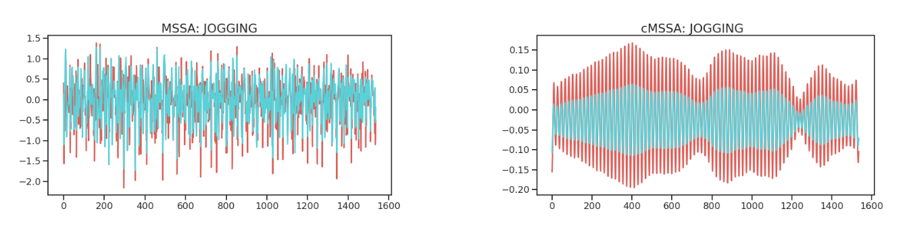

# Contrastive Multivariate Singular Spectrum Analysis



This repo contains the original implementation of **Contrastive Multivariate Singular Spectrum Analysis (cMSSA)** as outlined in this [paper](docs/neurips2018_workshop.pdf).

## Installation

To install, do:

```sh
git clone git@github.com:aadah/cMSSA.git
cd cMSSA
pip install .
```

Requires a `pip` version of 10 or higher.

## Basic Usage

```python
from cMSSA.ssa import CMSSA
from cMSSA.vis import plot_rcs

# 1. Instantiate a model that will utilize 10 principal components.
model = CMSSA(alpha=1.0, window=100, num_comp=10)

# 2. Fit on foreground time series contrasted against a background dataset.
model.fit(X_fg, X_bg)

# 3. Decompose time series data with your fitted model.
R = model.transform(X, collapse=False)

# 4. Visualize the contrastive sub-signals.
plot_rcs(R)
```
